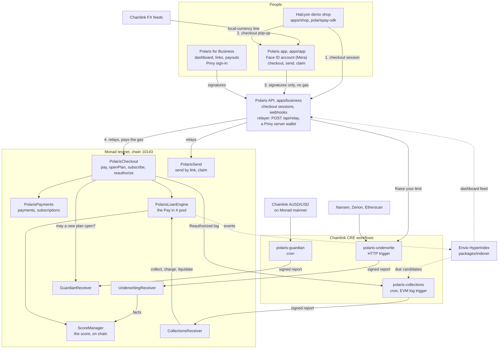

# Polaris: Stripe for every app on Monad

**Payment links with credit built in.** A merchant shares one link. The buyer
opens it, creates an account with Face ID and pays in dollars: in full, in
four instalments against a credit line, or on a subscription. The merchant is
paid in full, up front. People can also send dollars across borders by link,
and split a bill with one link.

| | |
|---|---|
| Track | Monad Metropolis, **Track 02: Consumer Products & Payments** |
| Sponsor bounties | Agora (AUSD, cross-border), Privy, Chainlink CRE, Nansen, Mera, Envio |
| Repository | [github.com/nickthelegend/polaris-monad](https://github.com/nickthelegend/polaris-monad) (MIT) |
| Demo video | `<VIDEO_URL>` (3:00; the script is [`video-script.md`](video-script.md)) |
| Network | Monad testnet (chain 10143), deployed 28 Sep 2026, every contract's source verified on Monadscan: [every address and transaction](../../README.md#monad-testnet-deployment) |
| Run it | `pnpm install && pnpm demo:local` ([README, "Run it"](../../README.md#run-it)) |

This write-up follows the plan's order ([`docs/plan.md` §9](../plan.md#9-submission-kit)).
Every claim links to the code or to a transaction. What is simulated, sample
or not live yet is said where it applies, and collected in
[What is not live yet](#what-is-not-live-yet).

---

## 1. The problem

Every app that sells something needs Stripe. On Monad today, an app still asks
a buyer to install a wallet, hold gas and pay in full, and the merchant waits
for money they then cannot easily move ([`docs/plan.md` §2, "The pitch"](../plan.md#the-pitch)).

Track 02 asks for consumer financial products that use on-chain rails as a
design advantage, for people who do not think of themselves as crypto users,
and it judges a user's first five minutes
([`docs/plan.md` §1.1](../plan.md#11-track-02-and-the-judging)). Three
problems stand between a normal buyer and a Monad checkout:

1. **Onboarding.** A seed phrase, an extension and gas before the first
   dollar moves.
2. **Paying in full.** A card checkout offers "pay in 4"; a Monad checkout
   asks for the whole amount now, because there is no credit line to draw on.
3. **Cross-border money.** Sending dollars on chain needs the recipient's
   address, so the person abroad needs a wallet before they can be paid.

## 2. The product

Two apps on one network, plus the pieces a merchant integrates
([README, "Components"](../../README.md#components)):

| Side | For | Signs in with | Does |
|---|---|---|---|
| **The Polaris app** ([`apps/app`](../../apps/app/README.md)) | Buyers and senders | Face ID ([Mera](../../apps/app/README.md#face-id-mera) passkeys) | Opens a payment link and pays **now**, **in 4** or **on a subscription**; sends dollars **by link**; **splits a bill** by link (local chain only so far, [§6, Monad Track 02](#monad-track-02)); shows the credit line and why. A phone PWA, a desktop layout from 1024px, and an **Android app** ([`apps/android`](../../apps/android/README.md), a Trusted Web Activity around the same app) |
| **Polaris for Business** ([`apps/business`](../../apps/business/README.md)) | Merchants and platforms | Privy (email) and an embedded payout wallet | Payment links, the checkout API and [`polarispay-sdk`](../../packages/sdk/README.md), a dashboard (payments, Pay in 4 ledger, payouts, developers), signed webhooks, one-tap and automatic payouts |
| **Halcyon** ([`apps/shop`](../../apps/shop/README.md)) | A demo store | | Takes Pay now, Pay in 4, a subscription and direct wallet payment through `polarispay-sdk`, against the real API and checkout |

**The numbers a buyer and a merchant see** (all from the deployment's
configuration, [`monad-testnet.json`](../../packages/contracts/deployments/monad-testnet.json) `config`):

- **Pay in 4 is 10% APR, pro-rated** (`interestRateBps: 1000`): a $200 order is
  **4 × $50.38**, $1.53 of interest, nothing due at checkout
  ([`apps/app/src/lib/data/quote.ts`](../../apps/app/src/lib/data/quote.ts);
  the relayer's test holds the schedule to `50.383562` per instalment,
  [`apps/business/test/relay.test.ts`](../../apps/business/test/relay.test.ts)).
  Halcyon's $349 headphones are 4 × $87.92 ([`apps/shop/README.md`](../../apps/shop/README.md#run-it-against-the-real-polaris-backend)).
- **The merchant is paid 100% when the plan opens**; Polaris carries the
  credit risk and the collections
  ([dashboard capture](../demo/43-dashboard-pay-in-4.png)).
- **Merchant fee 0.5%** on direct payments (`feeBps: 50`).
- **Opening credit lines run from $200 to $1,000**; higher lines come only
  from repaying ([`ScoreManager.sol`](../../packages/contracts/contracts/ScoreManager.sol)).

**Words the buyer never sees:** wallet, seed phrase, gas, MON, token,
blockchain. The buyer sees "account", "Face ID", "Confirm" and dollars
([`docs/plan.md` §2](../plan.md#words-the-buyer-never-sees)). The one
exception is *Raise your limit*, which asks for "a wallet you already use",
because it exists for people who already have one.

## 3. The first five minutes

A new buyer at Halcyon, on a phone, with no Polaris account. Each step is a
capture from the end-to-end run (`pnpm demo:e2e`, 24 of 24 steps,
[README](../../README.md#run-it)):

| # | The buyer | Capture |
|---|---|---|
| 1 | Picks the headphones, opens the bag, checks out with Polaris | [`25-newbuyer-1`](../demo/25-newbuyer-1-shop-product.png), [`-2`](../demo/25-newbuyer-2-shop-bag.png), [`-3`](../demo/25-newbuyer-3-shop-checkout.png) |
| 2 | The Polaris checkout opens in a pop-up, on Pay in 4 | [`25-newbuyer-4`](../demo/25-newbuyer-4-app-checkout-popup.png) |
| 3 | **Raise your limit** offers **Continue with Face ID**: one tap creates the account and asks for the line | [`25-newbuyer-5`](../demo/25-newbuyer-5-raise-your-limit.png) |
| 4 | The Chainlink CRE underwriting workflow opens a **$1,000 line on chain**, with its reasons in plain words ("First topped up from a major exchange · from Nansen · +10") | [`25-newbuyer-6`](../demo/25-newbuyer-6-limit-raised.png), [`20-payin4-6`](../demo/20-payin4-6-limit-raised.png) |
| 5 | Four payments, **nothing due today**, one *Confirm* | [`20-payin4-7`](../demo/20-payin4-7-app-checkout-with-line.png), [`20-payin4-8`](../demo/20-payin4-8-app-confirm.png) |
| 6 | The receipt; the pop-up closes and the shop's order is paid through a plan (a `plan.opened` webhook) | [`20-payin4-8b`](../demo/20-payin4-8b-app-receipt.png), [`20-payin4-9`](../demo/20-payin4-9-shop-order-plan.png) |
| 7 | The merchant sees the sale, paid in full, and the plan's four tick marks | [`43-dashboard-pay-in-4`](../demo/43-dashboard-pay-in-4.png) |

The buyer never installed anything, never saw a seed phrase and never
needed MON. Every step they took was a signature that the Polaris relayer carried
([§4, "Gasless by construction"](#gasless-by-construction)).

**Honest notes on these captures.** They ran on a local chain
(`pnpm demo:local`), where a dev signer stands in for Face ID and a badge on
every screen says "Dev signer · not Face ID". The Face ID path is Mera
([`apps/app/src/lib/account/mera.ts`](../../apps/app/src/lib/account/mera.ts));
on a phone it needs the app on an HTTPS domain inside its passkey domain,
which is not hosted yet: the steps and a deploy check are ready
([`docs/deploy.md`](../deploy.md)), the deploy itself is a team step
([README, "What only you can do"](../../README.md#what-only-you-can-do), step 6).
A line opened there is labelled "CRE workflow, local run", never "Verified
by Chainlink CRE" ([`provenance.ts`](../../apps/business/src/server/cre/provenance.ts)),
and its evidence comes from the live providers or not at all: a provider
without its key is reported as not configured, never answered from fixtures.
We have not timed link-to-paid; the video puts a clock on screen.

## 4. How it works

Solid lines run today, on the local chain end to end and on Monad testnet
([the deployment](../../README.md#monad-testnet-deployment), [the CRE runs](#chainlink-cre)).
Dashed lines are built and tested but not deployed: the Envio indexer is not
on Envio Cloud yet, so the dashboard and the collections workflow read the
chain directly ([Envio](#envio)).

**The pieces:**

- **Contracts** ([`packages/contracts`](../../packages/contracts/README.md)):
  `PolarisCheckout` is the only originator: it verifies the buyer's EIP-712
  intent and an ERC-2612 permit, then opens the plan in one transaction.
  `PolarisLoanEngine` pays the merchant from the pool and collects the four
  payments; `ScoreManager` computes the score **on chain** from attested
  facts; `PolarisSend` escrows a send against a one-time link key;
  `PolarisSplit` takes each friend's share of a split bill straight to the
  organiser (no custody; local chain only so far);
  `MerchantRegistry` registers a merchant by the merchant's own signature.
  Tests are named for the exploit they stop
  ([`test/metropolis/`](../../packages/contracts/test/metropolis),
  [`Exploits.test.js`](../../packages/contracts/test/Exploits.test.js)).
- **The API and relayer** ([`apps/business`](../../apps/business/README.md#the-relayer-plan-53-research-55)):
  checkout sessions with Stripe's shape, the relayer, webhooks, payouts. On
  Monad testnet the relayer is a policy-locked Privy server wallet
  ([Privy](#privy)). It checks every signature server-side, refuses one for another amount,
  merchant or order, and sets each gas limit to its estimate plus 15%, because
  Monad charges for the limit
  ([`submit.ts`](../../apps/business/src/server/relayer/submit.ts)).
- **The credit engine on Chainlink CRE** ([`workflows`](../../workflows/README.md)):
  three workflows decide who gets credit, collect what is owed, and pause new
  plans when the dollar depegs or the pool runs short ([Chainlink CRE](#chainlink-cre)).
- **Underwriting** ([`packages/underwriting`](../../packages/underwriting/README.md)):
  Nansen, Zerion and Etherscan data become the facts the DON attests, and the
  plain-language reasons the buyer reads.
- **The indexer** ([`packages/indexer`](../../packages/indexer/README.md)):
  Envio HyperIndex for every Polaris event.

### Gasless by construction

Every buyer, sender and merchant action is a signature; the relayer submits
it and pays the gas. The signature names the merchant, amount and order, so
the relayer can carry money but not redirect it
([`apps/business` README, "The relayer"](../../apps/business/README.md#the-relayer-plan-53-research-55),
the allow-list in [`policy/relayer.ts`](../../apps/business/src/server/policy/relayer.ts)):

| Action | Who signs | The relayer calls |
|---|---|---|
| Pay now | Buyer: ERC-3009 `ReceiveWithAuthorization` | `PolarisCheckout.pay` |
| Pay in 4 | Buyer: `PlanIntent` + ERC-2612 `Permit` (one *Confirm*) | `PolarisCheckout.openPlan` |
| Subscribe | Buyer: `SubscribeIntent` + `Permit` | `PolarisCheckout.subscribe` |
| Secure a line with collateral | Buyer: `Permit` to the vault | `CollateralVault.lockWithPermit` |
| Pay an instalment early | Buyer: `RepayIntent` | `PolarisLoanEngine.repayWithSig` |
| Cancel a subscription | Subscriber: `CancelSubscription` | `PolarisPayments.cancelWithSignature` |
| Sign again after a lost approval | Buyer: `Permit` to the loan engine | `PolarisCheckout.reauthorize` |
| Send by link, claim | Sender: ERC-3009; the link's one-time key over the recipient's address | `PolarisSend.send`, `claim` |
| Split a bill, pay a share (local chain only) | Organiser: `CreateSplit`; each friend: ERC-3009 for exactly their share | `PolarisSplit.createSplit`, `payShare` |
| Register, withdraw, pay out | Merchant's embedded wallet | `MerchantRegistry.registerFor`, the dollar's `transferWithAuthorization` |

`pnpm --filter @polarispay/contracts e2e:local` runs all twelve flows; the
buyer, the sender and the freelancer end with 0 MON
([README, "Tests and builds"](../../README.md#tests-and-builds)). On Monad
testnet, `smoke:testnet` ran every action above except the split and an
automatic payout, 14 of 14 checks, through the **Privy server wallet**: five fresh
accounts (a merchant, its payout address, a buyer, a send-by-link key and the
link's recipient) signed every step, and each ended as it began, with 0 MON
and nonce 0, read from the chain. The Privy relayer sent 15 transactions for
them and the Privy registry admin 2
([`docs/demo/testnet`](../demo/testnet/README.md)).

## 5. What's new in Metropolis

The repository's first commit, [`85b29e4`](https://github.com/nickthelegend/polaris-monad/commit/85b29e4a12bbcf849040d1c2b273807120a42462)
("Import pre-existing foundation from polaris-solana@daca8ca", 26 Sep 2026),
imports the pre-existing code byte-for-byte: **51 files, 7,149 lines**
(contracts and their tests, underwriting signals, `polarispay-sdk` 0.2.x, the
dunning ladder, webhook signing, score explanations; the list is in the
[README's "Pre-existing components"](../../README.md#pre-existing-components)).
Everything after it is new work for Metropolis.

From `85b29e4` to `ae2ce19` (28 Sep 2026): **567 commits** (531 without
merges), **1,761 files changed, 227,025 lines added, 1,387 removed**. The full
stat, every file, is [`diffstat.txt`](diffstat.txt); regenerate it with
`pnpm docs:diffstat` ([`scripts/submission-diffstat.mjs`](../../scripts/submission-diffstat.mjs)).
Work merged after `ae2ce19` (the Privy relayer live on testnet, split the
bill, the Android app, the hosting setup) is not in these figures yet; they
are regenerated at the submitted commit.
By folder:

| Folder | Files changed | of which binary | Lines added | Lines removed |
|---|---:|---:|---:|---:|
| `packages/contracts` | 103 | 0 | 45,495 | 137 |
| `apps/business` | 229 | 8 | 30,931 | 0 |
| `packages/underwriting` | 134 | 0 | 25,538 | 771 |
| `(root files)` | 8 | 0 | 18,963 | 0 |
| `apps/app` | 183 | 12 | 17,579 | 0 |
| `packages/indexer` | 64 | 0 | 15,339 | 0 |
| `packages/ui` | 82 | 1 | 14,795 | 0 |
| `workflows` | 96 | 0 | 14,612 | 0 |
| `docs` | 581 | 567 | 11,248 | 0 |
| `apps/shop` | 93 | 9 | 9,841 | 0 |
| `packages/sdk` | 55 | 0 | 8,379 | 249 |
| `scripts` | 14 | 0 | 4,621 | 0 |
| `apps/landing` | 62 | 12 | 4,228 | 0 |
| `packages/fx` | 15 | 0 | 2,472 | 0 |
| `packages/db` | 13 | 0 | 2,414 | 139 |
| `apps/gateway` | 7 | 0 | 318 | 91 |
| `packages/brand` | 19 | 13 | 140 | 0 |
| `.github` | 2 | 0 | 83 | 0 |
| `.claude` | 1 | 0 | 29 | 0 |
| **Total** | 1,761 | 622 | 227,025 | 1,387 |

How to read it fairly:

- **Generated lines are in there.** `pnpm-lock.yaml` is 18,110 of the root's
  lines; `packages/contracts/abi` is 26,359 lines exported from the compiled
  contracts (`pnpm --filter @polarispay/contracts abi`); and
  `packages/underwriting/fixtures` is 16,208 lines of synthesized provider
  responses ([its README](../../packages/underwriting/fixtures/README.md)).
  Without those three, 166,348 lines were added.
- **The 1,387 removed lines are the foundation's own**, changed or removed
  where Metropolis rebuilt it (new files have nothing to remove).
- **`docs` is mostly pictures**: 567 of its 581 files are screenshots and
  design references; its text is the plan and the research behind each
  sponsor integration.
- New since the import: every app (`apps/app`, `apps/business`, `apps/shop`,
  `apps/landing`), the three CRE workflows, the indexer, `packages/ui`,
  `packages/fx`, and in the contracts `PolarisCheckout`, `PolarisSend`, the
  three CRE receivers, the gasless entry points, on-chain underwriting and
  the Monad deployment.

The commit history is public and unsquashed: `git log --reverse` from `85b29e4`.

---

## 6. The bounties

Meeting each bounty's published requirements is 40% of its score
([`docs/plan.md` §1.1](../plan.md#11-track-02-and-the-judging)). For each one:
the requirement as the plan records it (the plan's §3 paraphrases copies of
the portal's bounty page, which needs a login to read; see
[`sources.md`](sources.md)), where it is met, the Monad testnet evidence, and
what is not done yet.

### Monad Track 02

**Requirement** ([`docs/plan.md` §1.1](../plan.md#11-track-02-and-the-judging), [§1.2](../plan.md#12-mandatory-for-every-submission-from-the-official-rules)):

> Track 02 is about consumer financial products that use on-chain rails as a
> design advantage, for people who don't think of themselves as crypto users.

Every entry also needs a public repository with a licence, a 3-minute video,
an explanation of the Monad integration with contract addresses, and a
deployment on Monad mainnet or testnet.

**Where it is met:**

| What | Where |
|---|---|
| A consumer payments product with no crypto words on the buyer's path | Pay by link (now, in 4, subscription) and send by link: [`apps/app`](../../apps/app/README.md), [`apps/business`](../../apps/business/README.md), [`PolarisCheckout.sol`](../../packages/contracts/contracts/PolarisCheckout.sol), [`PolarisSend.sol`](../../packages/contracts/contracts/PolarisSend.sol) |
| The first five minutes | [§3](#3-the-first-five-minutes) |
| Track 02's third example idea: split the bill | **Built and tested, local chain only.** `PolarisSplit`: the organiser signs the split once (equal or named shares) and shares one link; each friend pays exactly their share with one ERC-3009 signature, forwarded to the organiser in the same call (no custody, no owner); a friend with no account makes one with Face ID on the way ([`PolarisSplit.sol`](../../packages/contracts/contracts/PolarisSplit.sol), `polarispay-sdk` `splits.link()`, the app's split screens). `pnpm demo:e2e:split`, 22 of 22 steps ([`docs/design/split`](../design/split/README.md)). Not on Monad testnet: the deployment predates it, and the app hides split links where the API reports no split contract |
| On-chain rails as a design advantage | Credit underwritten from wallet history and scored on chain ([`ScoreManager.sol`](../../packages/contracts/contracts/ScoreManager.sol)); the merchant paid in full from the pool the moment the plan opens; claim links that a watcher cannot redirect ([`PolarisSend.test.js`](../../packages/contracts/test/metropolis/PolarisSend.test.js), "a watched claim cannot be redirected") |
| Gasless for the user | [§4, "Gasless by construction"](#gasless-by-construction); on Monad testnet, 14 of 14 through the Privy relayer with five accounts that never held MON ([`docs/demo/testnet`](../demo/testnet/README.md)) |
| Deployed on Monad testnet | 12 contracts on chain 10143 from commit `020484b` on 28 Sep 2026 (the same day, GuardianReceiver redeployed from `62aa43f`, and CollateralVault from `20518d2` with `lockWithPermit`), read back 65 of 65 ([`monad-testnet.check.txt`](../../packages/contracts/deployments/monad-testnet.check.txt)); **every source verified on Monadscan**, 14 of 14 exact matches: the 12 and the two they replaced ([`monad-testnet.verification.json`](../../packages/contracts/deployments/monad-testnet.verification.json)); addresses below |
| Monad-specific engineering | Gas limits at the estimate plus 15%, because Monad charges the limit: the relayer ([`submit.ts`](../../apps/business/src/server/relayer/submit.ts)) and every CRE write ("gas limit 326965 (estimate 284318)" in [the retry run's log](../../workflows/evidence/2026-09-28/collections-retry-081620.log)). The guardian reads Monad **mainnet** and writes to Monad **testnet** in one run ([Chainlink CRE](#chainlink-cre)) |
| Licence, AI disclosure, pre-existing code | [MIT](../../LICENSE); [README, "AI coding tools"](../../README.md#ai-coding-tools); [README, "Pre-existing components"](../../README.md#pre-existing-components) |

**The contracts on Monad testnet** (chain 10143, from
[`monad-testnet.json`](../../packages/contracts/deployments/monad-testnet.json);
each address's **Contract** tab on Monadscan shows its verified source):

| Contract | Address | Deployed in |
|---|---|---|
| MockAUSD (the labelled mock dollar, see [Agora](#agora)) | [`0x3F9554F15f58Bb5900822224f37A05be81eF9723`](https://testnet.monadscan.com/address/0x3F9554F15f58Bb5900822224f37A05be81eF9723) | [`0x117e473e…367239`](https://testnet.monadscan.com/tx/0x117e473ec59c69168cbd4a3901e140ee2af3d8e4593ca5af2e46b69866367239) |
| ScoreManager | [`0xB3D34eF62Cb64b985C230079D2815787619E6061`](https://testnet.monadscan.com/address/0xB3D34eF62Cb64b985C230079D2815787619E6061) | [`0xef12c071…70854c`](https://testnet.monadscan.com/tx/0xef12c0718ccb1fb7f2552d143e8de507f568a4646627c892caeff017be70854c) |
| PolarisLoanEngine | [`0xDaf74fa6A5cF2e03DF8E12613a8c8BF3A569204a`](https://testnet.monadscan.com/address/0xDaf74fa6A5cF2e03DF8E12613a8c8BF3A569204a) | [`0xe8c4f3bf…a374f`](https://testnet.monadscan.com/tx/0xe8c4f3bf90429faea48931eb0b5c2da008bc691ebe0f9921b865f654d56a374f) |
| PolarisPayments | [`0x7C774CF3E664B10057Cb2dDa66bA298e831292F1`](https://testnet.monadscan.com/address/0x7C774CF3E664B10057Cb2dDa66bA298e831292F1) | [`0x056b4738…9e18e`](https://testnet.monadscan.com/tx/0x056b47385754c208dc2d696b9ce4b8fe7c2090dc844c3bc75b8dde194609e18e) |
| MerchantRegistry | [`0x40A351282C9843C49f5Dd788d730a3d9Fe7627B4`](https://testnet.monadscan.com/address/0x40A351282C9843C49f5Dd788d730a3d9Fe7627B4) | [`0x50637e33…36fa`](https://testnet.monadscan.com/tx/0x50637e33dde8b8ba6401ac9c9a0dc1714d0ba0c1e649dc381d18ecabb9c636fa) |
| CollateralVault, redeployed with `lockWithPermit` (gasless collateral; it replaced [`0xD0e7…3E72`](https://testnet.monadscan.com/address/0xD0e777f8DfA2E62F500054E85F815fC54fae3E72)) | [`0xC2F006aE9836a700CE8F1e457d11346cc42e23dc`](https://testnet.monadscan.com/address/0xC2F006aE9836a700CE8F1e457d11346cc42e23dc) | [`0x4c71da11…b44453`](https://testnet.monadscan.com/tx/0x4c71da11c22e6e1d10b418c9fb0e605be1ae091367740724008aa16ff5b44453) |
| BatchSettlement | [`0x4F9478C66a82cEb1e1F8fE0117849e3F330cfc53`](https://testnet.monadscan.com/address/0x4F9478C66a82cEb1e1F8fE0117849e3F330cfc53) | [`0x28d8c131…1d083`](https://testnet.monadscan.com/tx/0x28d8c131cc2b7bb3fe9aa5805e5e9af32274ba17fb04302752a8dbea7f81d083) |
| PolarisSend | [`0x67D336c69881A4f3Fa4aaa2909cfcD95178DfC55`](https://testnet.monadscan.com/address/0x67D336c69881A4f3Fa4aaa2909cfcD95178DfC55) | [`0x9f81549c…924b9`](https://testnet.monadscan.com/tx/0x9f81549cd07cf46f018c77f175f596ab7cf535f484f87bf6079ce57fb84924b9) |
| PolarisCheckout | [`0x3874ef1bcE222755525a96f8284631780b9bC70B`](https://testnet.monadscan.com/address/0x3874ef1bcE222755525a96f8284631780b9bC70B) | [`0x5df03907…dc020c`](https://testnet.monadscan.com/tx/0x5df039074ed9a5b6e11c517955b42393a430d369a12c554096316a1d64dc020c) |
| CollectionsReceiver (CRE) | [`0x4201C0837f3bB4e0E1A982C5666BF00b5EE145CC`](https://testnet.monadscan.com/address/0x4201C0837f3bB4e0E1A982C5666BF00b5EE145CC) | [`0x0ac454dd…cc379`](https://testnet.monadscan.com/tx/0x0ac454dd6f28fea4ef998bbf63f0cc72e9d84ecc4cf725b8077dd3cf04bcc379) |
| UnderwritingReceiver (CRE) | [`0x523e9791d0e324525F66F91b21B478C18e284a19`](https://testnet.monadscan.com/address/0x523e9791d0e324525F66F91b21B478C18e284a19) | [`0xf643b392…f64c4a`](https://testnet.monadscan.com/tx/0xf643b392792f7f2a0c07edbf8e91a469e463fd065a9ef5d40b8bc59862f64c4a) |
| GuardianReceiver (CRE) | [`0x4c99136634F670cd59E73fc284fED164C662e3Df`](https://testnet.monadscan.com/address/0x4c99136634F670cd59E73fc284fED164C662e3Df) | [`0x2be128a3…038bf`](https://testnet.monadscan.com/tx/0x2be128a399ed2034f2fffe8caba46519bc5c6f116625b9cff364977ad27038bf) |

**Transactions a judge can open** (the smoke test through Privy, `pnpm
--filter @polaris/business smoke:testnet -- --run`, 28 Sep 2026, 14 of 14;
every hash in [`docs/demo/testnet`](../demo/testnet/README.md), read back
independently by `smoke:testnet:verify`):
the merchant registers [`0x576f4ead…833c74`](https://testnet.monadscan.com/tx/0x576f4ead74715bfc8038e9d9d6ea87e4f1dd8f5f934d5efa2380fa7e8e833c74);
Pay now $25 [`0xedc91c93…c22e6e`](https://testnet.monadscan.com/tx/0xedc91c93521bec8bb5ade52c2de7f0bdb654f2176aeb685b6ac73d2b28c22e6e);
$202 of collateral locked by a relayed permit [`0x2efc674a…04d5fc`](https://testnet.monadscan.com/tx/0x2efc674a32e4c3403288aa83f99ea5913a80ab10a796dfbe4a510d6f2d04d5fc);
Pay in 4 $200, plan #2 [`0x70cd0468…abdf06`](https://testnet.monadscan.com/tx/0x70cd0468cb0eeeb95fe5c9854e50dd6810f87c8412399b72955858a68dabdf06);
Subscribe $5 a month [`0xda41c41f…3f9224`](https://testnet.monadscan.com/tx/0xda41c41fc87de25b27c9c9413ecd612f4ad7645ddc3790b9a77bb2634a3f9224);
an instalment paid early [`0x557e6f99…f9504d`](https://testnet.monadscan.com/tx/0x557e6f997e8aa028e85860cb7073d6fa84c98fc2477ad7ee799c251654f9504d);
a lost approval signed again [`0xc34da0c3…b7fd19`](https://testnet.monadscan.com/tx/0xc34da0c3d6f2744e04f1ffb46e3cc73694947be4c20ccf9bd86604cc17b7fd19);
send $10 by link [`0xc262b283…9f5913`](https://testnet.monadscan.com/tx/0xc262b2838ea22630eff5873d0907ec88eb4240a333f07be77122262d619f5913)
and its claim [`0x30ee0025…c8119a`](https://testnet.monadscan.com/tx/0x30ee00250e065a8081da4360c5c18ed9a123d2bc57d65413d8ae8e6030c8119a);
the merchant's one-tap withdraw [`0x5ab0ecc0…0b7f48`](https://testnet.monadscan.com/tx/0x5ab0ecc02861ca4354f74d7d9dfac42792d72207de3c15158136cf8d540b7f48).
Each was sent by the Privy relayer
[`0x8366916019bc5452e62A0D36418ABebB45396aE2`](https://testnet.monadscan.com/address/0x8366916019bc5452e62A0D36418ABebB45396aE2)
for an account that only signed. The registry admin, a second Privy server
wallet ([`0xa089EeEA5B1625C586380596bde502aB46F3e45F`](https://testnet.monadscan.com/address/0xa089EeEA5B1625C586380596bde502aB46F3e45F)),
activated the merchant ([`0x0b9e45ff…bb1cb1`](https://testnet.monadscan.com/tx/0x0b9e45ffe03c3bea14d1b4866473f7dfb9f62dbd1cfac95628de3e5884bb1cb1)).
The only other sender was the harness (the deployer minting the mock dollar,
and submitting the buyer's own signed `permit(0)` to play a lost approval),
labelled as such. The buyer's Pay in 4 line is secured by that collateral,
because an unsecured line needs a CRE underwriting report, and none has run
on testnet yet ([Chainlink CRE](#chainlink-cre)).

An earlier run the same day, before the Privy relayer existed, used the
dev relayer
[`0x5e6934725eBCdfcA2d95D991045Fa813B51E2c69`](https://testnet.monadscan.com/address/0x5e6934725eBCdfcA2d95D991045Fa813B51E2c69)
(10 of 10, [`monad-testnet.smoke.json`](../../packages/contracts/deployments/monad-testnet.smoke.json)):
its Pay in 4 plan #1 [`0x4af42348…d2522d`](https://testnet.monadscan.com/tx/0x4af4234818aec669b3974c5c44f0f5cbe900858aa6e1e76bb413720374d2522d)
and its re-signed approval [`0xf02c45bd…173002`](https://testnet.monadscan.com/tx/0xf02c45bd4ec1102d8ee4a55ea54e9980c28ddff5e7a4dffd222ca0bbba173002)
are what the CRE collections runs below acted on.

**Not done yet, and why:**

- **No mainnet deployment.** `deploy:monad` refuses mainnet on purpose: the
  credit contracts are unaudited ([`docs/plan.md` §6](../plan.md#6-scope), WON'T).
- **No public URL yet.** The apps run with one command on a local chain.
  Hosting is prepared, not done: [`docs/deploy.md`](../deploy.md) takes the
  app, the landing page and the shop to Vercel and Polaris for Business to
  Fly.io (or Railway), and `pnpm deploy:check` checks the result; running it
  needs the team's accounts ([README, step 6](../../README.md#what-only-you-can-do)).
- **Split the bill is not on Monad testnet.** `PolarisSplit` came after the
  deployment; `deploy-split:monad` adds it in one transaction without moving
  anything else, and has not been run
  ([README](../../README.md#monad-testnet-deployment)).
- **PolarisCheckout on testnet predates two `reauthorize` fixes** that are in
  the code and its tests. Redeploying it would move every address the apps,
  indexer and workflows use, so it waits until after the freeze
  ([README](../../README.md#monad-testnet-deployment)).

### Agora

**Requirement** ([`docs/plan.md` §3](../plan.md#3-sponsor-strategy), Agora, Cross-Border Payments, Track 02 only):

> A mobile app where users send AUSD across borders, with Mera passkey
> onboarding and instant settlement.

**Where it is met:**

| Requirement | Where |
|---|---|
| Send dollars across borders | **Send by link.** The sender types an amount and gets a link; the link carries a one-time key in its URL fragment, which never reaches our server. `PolarisSend.send` escrows the dollars against that key by the sender's ERC-3009 signature; `claim` needs the key's signature over the recipient's address, so a watcher cannot redirect it, and a link pays out once. The sender can cancel; after expiry the dollars go back only to the sender. [`PolarisSend.sol`](../../packages/contracts/contracts/PolarisSend.sol), its tests [`PolarisSend.test.js`](../../packages/contracts/test/metropolis/PolarisSend.test.js); the app's [`send.tsx`](../../apps/app/src/sheets/send.tsx) and [`claim.tsx`](../../apps/app/src/sheets/claim.tsx). Captures: [Link ready](../demo/x-1440-send-link-ready.png), [the claim](../demo/x-390-claim-open.png), [Arrived](../demo/x-390-claim-arrived.png), ["Your link was claimed"](../demo/x-1440-notifications.png) |
| Pay across borders | A merchant's payment link is the same mechanism pointed at a business ([dashboard link](../demo/45-dashboard-share-link.png), [paid](../demo/46-link-3-app-receipt.png)) |
| AUSD | Balances, payments, the Pay in 4 pool, credit lines and payouts are all in one dollar. The app signs AUSD's own EIP-712 domain (`Agora Dollar`, version `1`, recorded in [`monad-testnet.json`](../../packages/contracts/deployments/monad-testnet.json) `eip712.Stablecoin`), checked by `pnpm --filter @polaris/app check:signatures` (53 checks against the Solidity typehashes) |
| Mera passkey onboarding | [Mera](#mera) |
| Instant settlement | Monad blocks every 400 ms and finality in about 800 ms ([`docs/plan.md` §2, "Why Monad"](../plan.md#why-monad-its-20-of-every-score-so-be-concrete)); a claim is one relayed transaction |
| Local currency next to dollars | The amount in the viewer's currency at the live **Chainlink** rate, with its age: "≈ ARS 161.241 · Chainlink rate, 7 h ago · indicative" ([capture](../demo/chainlink/01-fx-send-ars.png)). [`packages/fx`](../../packages/fx/README.md) reads Chainlink Data Feeds server-side (EUR, GBP, JPY, CHF and CAD from Monad mainnet; 18 more from Ethereum, Polygon or Base), served by the app's [`/api/fx`](../../apps/app/src/app/api/fx/route.ts). No feed, no line |
| Split a bill across borders | **Split the bill** (local chain only so far): one link, and each friend, wherever they are, pays exactly their share in dollars straight to whoever paid, with one signature; a friend with no account makes one with Face ID in the same step ([`PolarisSplit.sol`](../../packages/contracts/contracts/PolarisSplit.sol), captures in [`docs/design/split`](../design/split/README.md), `pnpm demo:e2e:split` 22 of 22). Not on Monad testnet yet ([Monad Track 02](#monad-track-02)) |
| A mobile app | An **Android app**: [`apps/android`](../../apps/android/README.md), package `app.polarispay.twa`, a Trusted Web Activity generated with Bubblewrap around the hosted app, so Face ID is Chrome's own passkey ceremony and one account works in Chrome, the PWA and the app; Send and Receive shortcuts; the site vouches for it with `/.well-known/assetlinks.json`. `pnpm --filter @polaris/android build` makes a signed APK ([the build of 28 Sep 2026](../../apps/android/README.md#the-build-of-28-sep-2026)). Also an installable phone PWA, with a desktop layout from 1024px ([`apps/app`](../../apps/app/README.md#screens)) |

**On Monad testnet:** `PolarisSend` is deployed at
[`0x67D336c69881A4f3Fa4aaa2909cfcD95178DfC55`](https://testnet.monadscan.com/address/0x67D336c69881A4f3Fa4aaa2909cfcD95178DfC55)
([`0x9f81549c…924b9`](https://testnet.monadscan.com/tx/0x9f81549cd07cf46f018c77f175f596ab7cf535f484f87bf6079ce57fb84924b9)).
In the smoke test through Privy, a sender with no MON sent $10 by link
([`0xc262b283…9f5913`](https://testnet.monadscan.com/tx/0xc262b2838ea22630eff5873d0907ec88eb4240a333f07be77122262d619f5913)),
and a fresh recipient address with no MON claimed it
([`0x30ee0025…c8119a`](https://testnet.monadscan.com/tx/0x30ee00250e065a8081da4360c5c18ed9a123d2bc57d65413d8ae8e6030c8119a));
the Privy relayer sent both, and the sender, the link's key and the
recipient each ended at 0 MON and nonce 0
([`docs/demo/testnet`](../demo/testnet/README.md)). That run was scripted,
not tapped through the app, which is not hosted yet.

**Not done yet, and why:**

- **The send and claim on Monad testnet were scripted.** In the app, send
  and claim ran end to end on the local chain (the captures above, and the
  last two flows of [`packages/contracts`](../../packages/contracts/README.md)' `e2e:local`);
  the app on testnet needs hosting ([README, step 6](../../README.md#what-only-you-can-do)).
- **The dollar on testnet is a labelled mock** (`MockAUSD`, "Mock AUSD"),
  because the deployer held no testnet AUSD for the pool (decision 24 in the
  [README](../../README.md#monad-testnet-deployment)). A redeploy with
  `AUSD_MODE=ausd` uses real AUSD once we hold some.
- **The Android app is built, not yet on a phone or in a store.** The APK is
  signed with a local debug key; nobody has installed it on a real phone yet,
  and whether Mera's PRF works inside a Trusted Web Activity is unverified
  there (it should: a TWA is Chrome). It opens with an address bar until the
  app is hosted with the APK's fingerprint, and Google Play needs the team's
  Play Console account ([`apps/android`, "Status"](../../apps/android/README.md#status)).
- **Split the bill has only run on the local chain** (above).

### Privy

**Requirement** ([`docs/plan.md` §3](../plan.md#3-sponsor-strategy), Privy, all tracks):

> Use Privy beyond authentication; login-only doesn't qualify.

**Where it is met** (live on Monad testnet since 28 Sep 2026, with the
Privy app behind Polaris for Business; every id, address and rule is in
[`apps/business/privy-live.md`](../../apps/business/privy-live.md), read
back from Privy into [`privy-live.json`](../demo/testnet/privy-live.json)):

| Requirement | Where |
|---|---|
| Policy-controlled server wallets | **The relayer is a Privy server wallet**, [`0x8366916019bc5452e62A0D36418ABebB45396aE2`](https://testnet.monadscan.com/address/0x8366916019bc5452e62A0D36418ABebB45396aE2) ([`signer.ts`](../../apps/business/src/server/relayer/signer.ts)), held to a 17-rule policy built from one allow-list ([`policy/relayer.ts`](../../apps/business/src/server/policy/relayer.ts)): one `DENY` for any transaction carrying MON, then one `ALLOW` per Polaris function (chain, contract, function, and a $0.10 floor where an amount is signed); anything else matches no rule and Privy refuses it. The wallet and its policy are owned by an admin key quorum, and the server's own key is a separate quorum held to the same policy, so a stolen server key cannot change the policy ([`scripts/privy/setup-relayer.mjs`](../../apps/business/scripts/privy/setup-relayer.mjs)). **A second Privy server wallet, the registry admin**, [`0xa089EeEA5B1625C586380596bde502aB46F3e45F`](https://testnet.monadscan.com/address/0xa089EeEA5B1625C586380596bde502aB46F3e45F), owns `MerchantRegistry` ([`0x34f00f29…bef710`](https://testnet.monadscan.com/tx/0x34f00f294ef9da35f43c08bb1606e6dc10a9119cd8ab92632922cf1a60bef710)) under a policy that allows only activating a merchant and capping it at up to $1,000 |
| The policy, proven by Privy | `privy:prove-policy -- --run`: Privy signed the 3 allowed calls and refused all 7 others with `policy_violation`: a $0 collateral lock, the vault's `seize`, a $0 transfer, the same call carrying 1 wei of MON, the same call to another contract, `approve(attacker, max)`, and a plain MON transfer ([output](../demo/testnet/privy-prove-policy.txt)) |
| Gasless, through Privy, on chain | `smoke:testnet`, 14 of 14: every buyer and merchant action, sent by the Privy relayer (15 transactions) and the Privy registry admin (2), for five fresh accounts that stayed at 0 MON and nonce 0 ([`docs/demo/testnet`](../demo/testnet/README.md); [§6, Monad Track 02](#monad-track-02) lists the hashes). `privy:smoke`: a $0.50 Pay now, [`0x5ef22fce…c4f983`](https://testnet.monadscan.com/tx/0x5ef22fced32a6c4d2192a25691caddbf604700934bd505a35830e77922c4f983), session paid, the buyer at 0 MON ([output](../demo/testnet/privy-smoke.txt)) |
| Embedded wallets doing real work | Every merchant gets an embedded wallet on sign-in ([`privy-auth.tsx`](../../apps/business/src/components/auth/privy-auth.tsx), `createOnLogin: "all-users"`). It signs the merchant's `MerchantRegistry` registration right after the business is named (`useRegisterMerchant` in [`payouts.ts`](../../apps/business/src/lib/payouts.ts), [`registration.tsx`](../../apps/business/src/components/dashboard/registration.tsx)) and every withdrawal (`POST /api/payouts`, [`route.ts`](../../apps/business/src/app/api/payouts/route.ts)), gas-free through the relayer |
| Automatic payouts | `POST /api/payouts/automatic` creates the merchant's own policy (only the dollar, only this chain, only from their wallet, only to their payout address, at most $10,000 a payout), and the browser adds our payout signer under it with `addSigners` ([`policy/payout.ts`](../../apps/business/src/server/policy/payout.ts), [`route.ts`](../../apps/business/src/app/api/payouts/automatic/route.ts)). The payout signer's key quorum exists in the Privy app |
| Server-side authentication | Every dashboard route verifies the Privy access token with `@privy-io/node`; nothing the client sends can name the merchant or their wallet ([`apps/business` README](../../apps/business/README.md#merchants-onboarding-and-payouts)) |
| The same policy, enforced in our code | `checkRelayerCall` applies the allow-list before anything is signed, so the local dev adapter used by `pnpm demo:local` is held to exactly the production policy; `pnpm --filter @polaris/business test` (264 passing) covers it |

Gas sponsorship: Polaris does not use Privy's native sponsorship and does not
need it, because no user or merchant wallet ever sends a transaction; they
sign, and the relayer pays the gas from its own MON
([`privy-live.md`](../../apps/business/privy-live.md#gas-sponsorship-what-privy-offers-and-why-polaris-doesnt-need-it)).

**Not done yet, and why:**

- **The merchant in the live runs was a generated key**, signing the same
  typed data (registration, withdrawal) an embedded wallet signs; no merchant
  has signed in through Privy on a hosted dashboard yet, because it is not
  hosted ([README, step 6](../../README.md#what-only-you-can-do)). The
  recorded demo's dashboard runs on `pnpm demo:local`'s local session with
  Privy off.
- **No automatic payout has run live yet.** The code and its policy are
  tested; a merchant has to turn it on in a hosted dashboard.
- **Dashboard steps for the team** ([README, step 4](../../README.md#what-only-you-can-do)):
  the login methods, the hosted origins as allowed domains, and moving the
  admin key quorum's key offline.

The consumer app also uses Privy for **Continue with email** (an embedded
wallet), beneath Face ID ([Mera](#mera)).

### Chainlink CRE

**Requirement** ([`docs/plan.md` §3](../plan.md#3-sponsor-strategy), Chainlink, CRE, all tracks):

> Build, simulate or deploy a CRE workflow used as an orchestration layer.

Chainlink's standard version of this bounty adds three tests: connect a
blockchain to an outside API or data source, show a CRE CLI simulation or a
deployment, and be meaningfully used in the project ([`sources.md`](sources.md#chainlink-cre)).

**Where it is met.** Three workflows (`@chainlink/cre-sdk` 1.22.0, CRE CLI
v1.35.0) run Polaris's credit, using all three trigger types. Every run with
work to do ends in a signed report that Chainlink's forwarder delivers to a
Polaris receiver on Monad, and every report changes what the product does
next ([`workflows/README.md`](../../workflows/README.md#why-it-is-load-bearing)):

| Workflow | Trigger | What it orchestrates | Code | Receiver |
|---|---|---|---|---|
| `polaris-underwrite` | **HTTP** (the API fires it when a buyer taps *Raise your limit*) | Checks the buyer's signed consent and the history wallet's proof; reads the chain; calls Nansen, Zerion and Etherscan (through Confidential HTTP when switched on); attests **facts, never a score**. `ScoreManager` scores them on chain and caps the opening line at $1,000. No report, no unsecured credit (`requireUnderwriting: true`) | [`workflows/underwriting/main.ts`](../../workflows/underwriting/main.ts), [`src/underwriting/`](../../workflows/src/underwriting) | `UnderwritingReceiver` [`0x523e…4a19`](https://testnet.monadscan.com/address/0x523e9791d0e324525F66F91b21B478C18e284a19) → `ScoreManager.underwrite` |
| `polaris-collections` | **Cron** | Finds due Pay in 4 instalments, subscription renewals and plans past grace (from Envio, or the chain), checks them at a finalized block with `checkTasks`, and collects, charges or liquidates in one report; failures feed the dunning ladder | [`workflows/collections/main.ts`](../../workflows/collections/main.ts), [`src/collections/workflow.ts`](../../workflows/src/collections/workflow.ts) | `CollectionsReceiver` [`0x4201…45CC`](https://testnet.monadscan.com/address/0x4201C0837f3bB4e0E1A982C5666BF00b5EE145CC) |
| `polaris-collections`, instant retry | **EVM log** on `PolarisCheckout.Reauthorized` | A buyer whose approval was lost signs once; the log starts a run that collects what that buyer owes in the next block, instead of waiting 6 hours for the ladder's next rung | [`src/collections/retry.ts`](../../workflows/src/collections/retry.ts) | the same `CollectionsReceiver` |
| `polaris-guardian` | **Cron** | Reads **Chainlink's AUSD/USD on Monad mainnet** ([`0xE20751C7B5867bCBef815ffc1b284c3f412a9e13`](https://monadscan.com/address/0xE20751C7B5867bCBef815ffc1b284c3f412a9e13)) and the pool on Monad testnet in one run, and attests a verdict: depeg (outside $0.995 to $1.005), low free cash, bad debt, or a stale price. `PolarisCheckout.openPlan` asks `GuardianReceiver` before every new plan; Pay now, Send and Subscribe never ask. The receiver reads the pool itself and trusts the report for the mainnet price only | [`workflows/guardian/main.ts`](../../workflows/guardian/main.ts), [`src/guardian/workflow.ts`](../../workflows/src/guardian/workflow.ts) | `GuardianReceiver` [`0x4c99…e3Df`](https://testnet.monadscan.com/address/0x4c99136634F670cd59E73fc284fED164C662e3Df) |

**On Monad testnet** (28 Sep 2026): each row is one `cre workflow simulate
--broadcast` run with the CRE CLI v1.35.0, its report delivered through
Chainlink's `monad-testnet` forwarder
[`0xB9F79d863261869B234c481D1f9A7af84AeAd192`](https://testnet.monadscan.com/address/0xB9F79d863261869B234c481D1f9A7af84AeAd192),
read back with status 1 and `ReportProcessed` `result=true`
([`workflows/evidence/2026-09-28/`](../../workflows/evidence/2026-09-28/README.md), [`runs.json`](../../workflows/evidence/2026-09-28/runs.json)):

| Workflow and trigger | What happened | Transaction | Block | Log |
|---|---|---|---:|---|
| `polaris-collections`, **EVM log** | The buyer re-signed ([`0xf02c45bd…173002`](https://testnet.monadscan.com/tx/0xf02c45bd4ec1102d8ee4a55ea54e9980c28ddff5e7a4dffd222ca0bbba173002)); the workflow read what they owed and `CollectionsReceiver` collected instalment #1 | [`0x1116fbb4…292c4d`](https://testnet.monadscan.com/tx/0x1116fbb4b53263776da4c5cc6d7984b66f1d31ac81f35215b5dcf246f1292c4d) | 66359311 | [log](../../workflows/evidence/2026-09-28/collections-retry-081620.log) |
| `polaris-collections`, **cron** | Found due and overdue plans on chain: collected one instalment and liquidated a plan past its grace period | [`0xd7bcf41e…1a97e4`](https://testnet.monadscan.com/tx/0xd7bcf41e8efa7841c86870689a3c9599c3a960d39f4c28b82c6980dc1f1a97e4) | 66359350 | [log](../../workflows/evidence/2026-09-28/collections-081643.log) |
| `polaris-guardian`, **cron** | Read Chainlink AUSD/USD on Monad mainnet (0.99982194), read the pool on testnet, attested "healthy, Pay in 4 open" as round 1 | [`0x015bd95d…3f9080`](https://testnet.monadscan.com/tx/0x015bd95da145efb4884ea0e50730728a2023a15f890f737847ede4064e3f9080) | 66359401 | [log](../../workflows/evidence/2026-09-28/guardian-081657.log) |
| `polaris-underwrite`, **HTTP** | Ran and wrote nothing, correctly: without provider keys it could not confirm the account's first-seen date and sent count, and returned `incomplete` instead of guessing | none, by design | | [log](../../workflows/evidence/2026-09-28/underwriting-082225.log) |

**In the product, end to end** (`DEMO_FAST_PLANS=1 pnpm demo:local` and
`pnpm demo:e2e:chainlink`, 18 of 18 steps, on the local chain with each
workflow's real handler on the CRE SDK's test runtime; [`docs/demo/chainlink`](../demo/chainlink/README.md)):
*Raise your limit* opens a line from an underwriting report; the guardian
pauses Pay in 4 when the owner raises the depeg threshold above the real
Chainlink price ("threshold raised for demo") while Pay now keeps working,
and resumes it when the threshold is restored; a dunned buyer who signs again
is collected **2 s later** by the log trigger
([capture](../demo/chainlink/17-app-plan-collected.png)).

**Tests:** 209 unit tests on the SDK's test runtime, `e2e:local` 12 of 12
against real contracts, and all three workflows compile to WASM with
`cre workflow build` ([`workflows/README.md`, "Status"](../../workflows/README.md#status)).

**Not done yet, and why:**

- **Not deployed to a DON.** `cre workflow deploy` needs deploy access, which
  the CLI says is not enabled for our organisation yet ("Run cre account
  access to request deployment access", at the end of each log). The bounty
  accepts simulation.
- **Simulated reports carry no DON signatures.** Each receiver accepts them
  only from our dedicated simulation transmitter
  [`0xBBb420B7e4b0263d053e00bFD363eD7cF21e2EA6`](https://testnet.monadscan.com/address/0xBBb420B7e4b0263d053e00bFD363eD7cF21e2EA6);
  after a DON deploy, `lock-receivers:monad` pins the workflow ids and moves
  the receivers to the production forwarder. That is why a credit line reads
  "Verified by Chainlink CRE" only for a DON-signed report
  ([`provenance.ts`](../../apps/business/src/server/cre/provenance.ts)).
- **No underwriting report on testnet, and no live Confidential HTTP call.**
  Both need provider API keys (a free Etherscan key is enough to start) and a
  consenting history wallet; the switch is implemented and unit-tested
  ([`workflows/README.md`, "Confidential HTTP"](../../workflows/README.md#confidential-http)).
- **The testnet runs used the chain for candidates and no API callback**
  (`candidates: chain`, `callbackStatus: null` in [`runs.json`](../../workflows/evidence/2026-09-28/runs.json)),
  because the indexer is not deployed and the committed staging config has no
  public API URL yet.

### Nansen

**Requirement** ([`docs/plan.md` §3](../plan.md#3-sponsor-strategy), Nansen, all tracks):

> A product experience powered by Nansen data, API, MCP or CLI that goes
> beyond exposing raw data.

**Where it is met.** Nansen's data decides how much credit a person gets;
the buyer never sees a data table
([`packages/underwriting` README, "Why Nansen is load-bearing"](../../packages/underwriting/README.md#why-nansen-is-load-bearing)):

| Nansen data | What it becomes |
|---|---|
| **First funder** of a linked wallet | Its age (up to 60 points), whether it was first topped up from an exchange (+10, shown to the buyer as "First topped up from a major exchange · from Nansen"), and the funder the sybil check runs on |
| **Related wallets** on that funder | The sybil check: 4 to 24 accounts from one non-exchange funder cost up to 80 points; 25 or more decline the line |
| **The funder's label** | A risk screen: a wallet first funded through a mixer or by an exploiter is not counted as history |
| **Balance, transactions** | Fallbacks when Zerion cannot answer |

The path: [`nansen.ts`](../../packages/underwriting/src/core/providers/nansen.ts)
→ the facts the `polaris-underwrite` workflow attests → `ScoreManager`
scores them **on chain** → the buyer sees their line and the reasons behind
it, explained from the facts in the forwarder transaction
([`explain.ts`](../../apps/business/src/server/credit/explain.ts)): in the
checkout ([capture](../demo/20-payin4-6-limit-raised.png)), the credit screen
and the dashboard's "Why your buyers got credit"
([capture](../demo/41-dashboard-panels.png)). Every reason Nansen backs
carries `provider: "nansen"`. `pnpm --filter @polarispay/underwriting test`:
285 passing.

**Not done yet, and why:** **no live Nansen call yet.** We had no Nansen API
key while building, so every run read synthesized fixtures in Nansen's
documented response shapes, each labelled as such
([`fixtures/README.md`](../../packages/underwriting/fixtures/README.md)).
Those fixtures are now test doubles only: without `NANSEN_API_KEY` the
product reports Nansen as not configured, and a linked wallet whose risk
checks need it is not underwritten.
With a key, `pnpm --filter @polarispay/underwriting record --linked <wallet>`
records real responses. Nansen covers Monad mainnet only, so it scores the
buyer's linked history wallet; a new testnet account goes through Zerion
([`docs/plan.md` §3.4](../plan.md#34-stack-ons-small-extra-work-real-money)).

### Mera

**Requirement** ([`docs/plan.md` §3](../plan.md#3-sponsor-strategy), Mera UX, all tracks):

> Mera is the entire account layer: no seed phrase, no extension, no custody
> backend.

**Where it is met** ([`apps/app` README, "Face ID (Mera)"](../../apps/app/README.md#face-id-mera)):

| Requirement | Where |
|---|---|
| Face ID creates the account | `createPasskeyWithPrfOutput`, then `createSecp256k1SigningSession` → a viem account ([`mera.ts`](../../apps/app/src/lib/account/mera.ts)); creating an account and paying is **one** Face ID |
| No seed phrase | The passkey's PRF output becomes the key in the browser and is zeroed after use ([`derive.ts`](../../apps/app/src/lib/account/derive.ts)); only public metadata is stored, and every sign-in recomputes the key |
| No extension | A plain web page; supported devices and the "Open Polaris on your phone" fallback are listed in [`apps/app` README](../../apps/app/README.md#supported-devices) |
| No custody backend | The relayer holds only its own MON for gas, never user funds; every money movement is the account's own signature ([§4](#gasless-by-construction)) |
| Nothing else stands in for it | The dev signer exists only in `next dev` with `NEXT_PUBLIC_DEV_SIGNER=1`; a production build blanks the flag ([`next.config.ts`](../../apps/app/next.config.ts)) |

**Not done yet, and why:**

- **The recorded demo uses the dev signer**, because Face ID on a phone needs
  the app on an HTTPS domain inside its passkey domain, and it is not hosted
  yet. The badge on every screen says so.
- **The app also offers "Continue with email"** (a Privy embedded wallet)
  beneath Face ID ([`apps/app` README, "Accounts"](../../apps/app/README.md#accounts)).
  Whether that fits "the entire account layer" is a question for Mera; the
  option can be removed.

### Mera: One Passkey, Many Keys

**Requirement** (the bounty's title on the portal, as our brief records it):

> Most creative non-wallet use of Mera's PRF-derived key material.

Our entry is **receipts only you can read**: the Face ID that derives the
wallet key also seals the buyer's purchase history, so our database holds it
as ciphertext only their Face ID opens. The design, its sources and the
options weighed are in [`docs/research/mera.md` §16](../research/mera.md#16-receipts-only-you-can-read-the-non-wallet-use-of-prf-key-material);
we ship option A (keys from the sign-in PRF output: no extra prompt).

**Where it is met** ([`apps/app` README, "Receipts only you can read"](../../apps/app/README.md#receipts-only-you-can-read)):

| Requirement | Where |
|---|---|
| Keys other than the wallet's, from the PRF output | [`packages/receipts/src/keys.ts`](../../packages/receipts/src/keys.ts): HKDF-SHA-256 with one versioned label per key (`polaris/v1/receipts/aes-256-gcm`, `polaris/v1/receipts/hpke-x25519-ikm`), a non-extractable AES-256-GCM key and an RFC 9180 `DeriveKeyPair` X25519 inbox key pair; intermediate bytes zeroed; nothing stored |
| In the same ceremony, the wallet untouched | [`mera.ts`](../../apps/app/src/lib/account/mera.ts) derives them from the PRF output of the create or sign-in ceremony before zeroing it; [`derive.ts`](../../apps/app/src/lib/account/derive.ts) is unchanged, and a test pins an address from it |
| A use that isn't the wallet | What was bought (description, line items, order, the plan's schedule) is sealed to the inbox key with HPKE when a payment settles, including the receipts the server writes while the buyer is away (instalments collected, subscription charges), and the plaintext is dropped ([`server/receipts.ts`](../../apps/business/src/server/receipts.ts), [`ingest.ts`](../../apps/business/src/server/ingest/ingest.ts)) |
| The server can't swap or forge | The AAD is `polaris.receipt.v1`, the owner and the receipt id; the inbox key is accepted only with the account's own EIP-191 signature, and receipts are served only for a fresh one ([`test/receipts.test.ts`](../../apps/business/test/receipts.test.ts)) |
| The buyer's path | Activity and the payment's details show **Only your Face ID can open this** until the session opens it; with the account open, no prompt ([`sealed-receipt.tsx`](../../apps/app/src/components/sealed-receipt.tsx)). Settings explains it; email accounts, which have no PRF, are told their receipts are not sealed |

**Not done yet, and why:**

- **Not opened with a real Face ID on a phone.** The app is not hosted on a
  domain inside its passkey rpId yet; the demo's dev signer derives the same
  keys from a stand-in PRF output instead.
- **The AES key has no writer yet.** It is derived and tested; private notes
  on a receipt would use it.
- **What stays in the clear:** what the chain shows anyway, the merchant's
  order id and metadata, and a payment link's title and a subscription
  plan's name (the merchant's catalogue, shared by every buyer).
- **Option B** (a PRF namespace of its own, so even the recovery phrase
  couldn't read receipts) is not built: it costs a second Face ID.

### Envio

**Requirement** ([`docs/plan.md` §3](../plan.md#3-sponsor-strategy), Envio, all tracks):

> HyperIndex, HyperSync or HyperRPC powering real on-chain data behind a core
> feature.

**Where it is met:**

| Requirement | Where |
|---|---|
| A HyperIndex indexer of every Polaris event | [`packages/indexer`](../../packages/indexer/README.md): `envio` 3.12.1, HyperSync on Monad testnet, the deployed addresses from block 66288120 ([`config.yaml`](../../packages/indexer/config.yaml)), [`schema.graphql`](../../packages/indexer/schema.graphql), a webhook outbox that emits exactly `polarispay-sdk`'s events; handler tests run in CI ([`.github/workflows/indexer.yml`](../../.github/workflows/indexer.yml)) |
| Behind a core feature: collections | The CRE collections workflow's candidate list is the indexer client's `DUE_CANDIDATES` query ([`candidates.ts`](../../workflows/src/collections/candidates.ts), [`documents.ts`](../../packages/indexer/client/src/documents.ts)) |
| Behind a core feature: the merchant dashboard | The dashboard's "Indexed by Envio" feed reads it through `@polarispay/indexer-client` when `POLARIS_INDEXER_URL` is set ([`insights.ts`](../../apps/business/src/server/insights.ts), [`test/insights.test.ts`](../../apps/business/test/insights.test.ts)); the chain sync can read logs from Envio's HyperRPC (`POLARIS_LOGS_RPC_URL`) |

**Not done yet, and why:** **the indexer is not deployed.** Envio Cloud needs
the team's login and its GitHub app, and its free plan deletes a deployment
after 30 days, so the plan deploys it on or after 5 Oct to keep it up through
judging ([`docs/plan.md` §3.4](../plan.md#34-stack-ons-small-extra-work-real-money)).
Until then the dashboard shows its own chain sync with a "Chain sync" pill
([capture](../demo/41-dashboard-panels.png)), and the testnet CRE runs took
their candidates from the chain (`candidates: chain` in
[`runs.json`](../../workflows/evidence/2026-09-28/runs.json)). `envio dev`
needs Docker, which the build machine did not have; the handler tests run in
WSL or CI.

---

## What is not live yet

In one place ([README, "What is simulated or sample"](../../README.md#what-is-simulated-or-sample)):

- **The captures in [`docs/demo`](../demo)** ran on a local Hardhat chain,
  deployed by the same script as testnet. Receipts there link nowhere.
- **On Monad testnet** the contracts (every source verified) and every
  transaction linked here are real, and the relayer is the policy-locked
  Privy server wallet; the dollar is `MockAUSD`, the smoke test's accounts are
  generated keys driven by a script (the apps are not hosted yet), and the CRE
  reports are CLI simulations delivered through Chainlink's simulation
  forwarder.
- **Split the bill** has run only on the local chain; `PolarisSplit` is not
  on Monad testnet.
- **The Android app** is a signed APK built from the repository; it has not
  been installed on a real phone yet.
- **Face ID** is the dev signer in the demo; the badge says so.
- **Underwriting evidence** is live or absent: a provider without its key
  (`NANSEN_API_KEY`, `ZERION_API_KEY`, `ETHERSCAN_API_KEY`) is reported as not
  configured and what only it reads counts for nothing; the synthesized
  fixtures serve the tests only. No live Nansen, Zerion or Etherscan call has
  been made yet.
- **Chainlink's AUSD/USD and FX rates are real**, read from Chainlink's feeds;
  nothing writes to mainnet. The demo's guardian pause is the owner raising
  the threshold above the real price, captioned "threshold raised for demo";
  the price is never faked.

## What's next

From the [README, "What's next"](../../README.md#whats-next) and the
[plan](../plan.md#6-scope):

1. **Live sponsor services before the freeze:** Envio Cloud, provider keys
   for a real underwriting report and the first live Confidential HTTP call,
   the hosted apps ([`docs/deploy.md`](../deploy.md)) so Face ID runs on a
   phone and in the Android app, and `PolarisSplit` on testnet
   (`deploy-split:monad`).
2. **The CRE workflows on a DON** once deploy access comes through, with the
   receivers locked to them; credit lines then read "Verified by Chainlink CRE".
3. **One owner key is a single point of failure.** After the freeze,
   ownership moves to a multisig with a timelock on the receivers' forwarder
   and threshold settings.
4. **Real AUSD** on testnet, then credit on mainnet after an audit.
5. **Bank payouts.** Out of scope here: Mercuryo, the off-ramp we checked,
   cannot pay out AUSD on Monad ([`docs/plan.md` §3.6](../plan.md#36-not-targeting-on-purpose)).
6. **CCIP** to take Pay in 4 repayments in AUSD from another chain.
